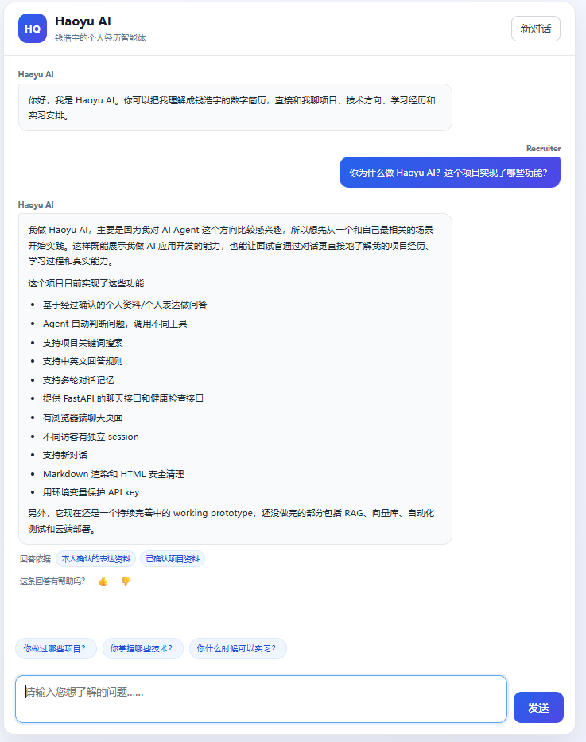
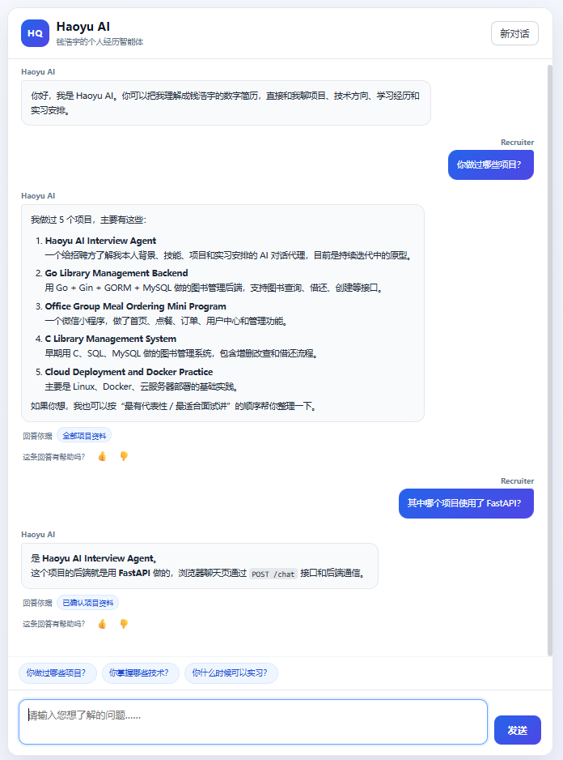
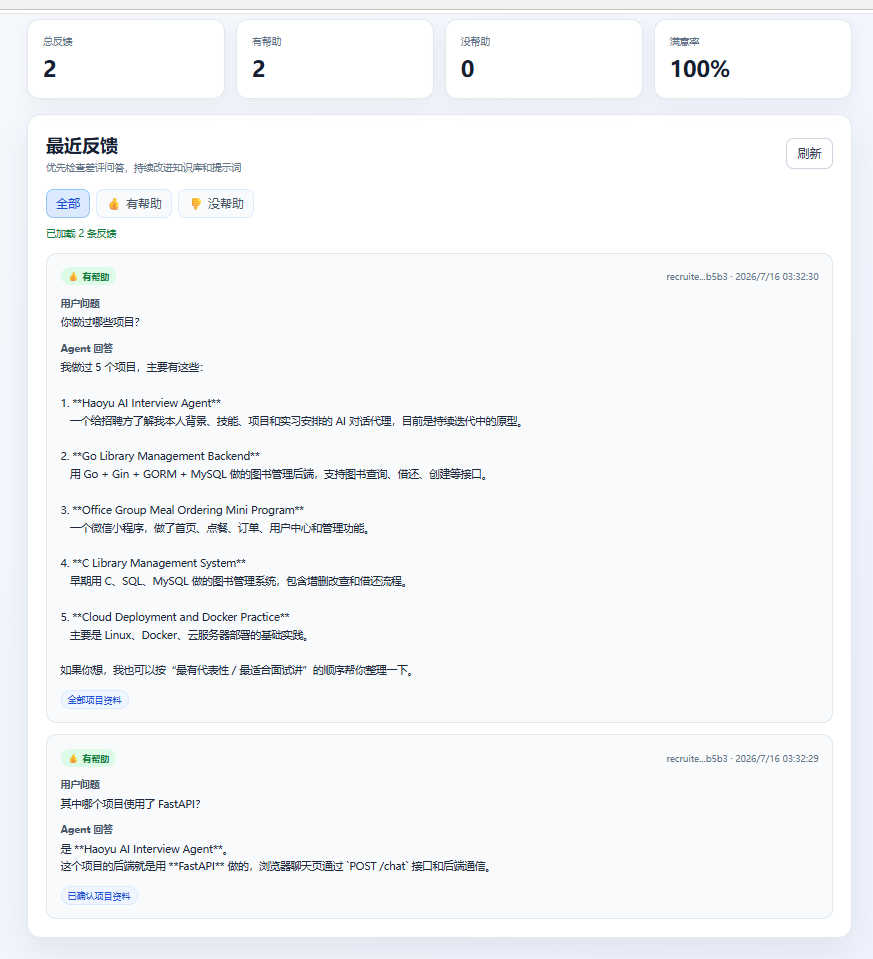
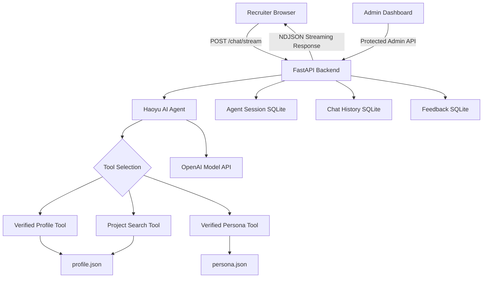

# Haoyu AI Interview Agent

A personal AI interview agent that allows recruiters to learn about Haoyu Qian's verified background, technical skills, projects, motivations, and internship availability through natural conversation.

This project is built with the OpenAI Agents SDK, FastAPI, SQLite, native JavaScript, and Docker.

> 中文说明：这是一个基于本人确认资料构建的个人 AI 智能体。招聘者可以通过对话了解我的项目经历、技术能力、学习动机和实习安排。

---

## Overview

Traditional resumes can only present limited information and cannot respond to follow-up questions.

Haoyu AI turns a static resume into an interactive AI assistant. It can:

- answer questions based on verified personal information;
- distinguish completed work from skills that are still being learned;
- select different tools according to the user's question;
- maintain multi-turn conversation context;
- explain project motivations and learning experiences naturally;
- show which verified data source was used for each answer;
- collect user feedback for future improvement.

The agent is explicitly instructed not to invent experiences, skills, project results, or employment history.

---

## Demo

### AI Interview Chat

Recruiters can ask questions about my verified projects, skills, motivations, and internship availability.



### Multi-turn Conversation

The agent preserves conversation context and selects different tools for follow-up questions.



### Feedback Dashboard

A protected administrator dashboard displays answer ratings, satisfaction statistics, and recent feedback records.



## Core Features

### Verified knowledge grounding

The project separates knowledge into two categories:

- `profile.json`: objective facts such as education, skills, projects, awards, and internship availability;
- `persona.json`: confirmed motivations, problem-solving methods, growth areas, and career expectations.

The agent must query these verified sources before answering personal-experience questions.

### Intelligent tool selection

The agent selects tools according to the question:

- `get_verified_profile`: education, skills, awards, and internship arrangements;
- `get_all_verified_projects`: complete project list;
- `search_verified_projects`: project search by technology or feature;
- `get_verified_persona`: motivations, learning methods, weaknesses, and internship goals.

### Multi-turn conversation

SQLite-backed sessions preserve conversation context, allowing follow-up questions such as:

```text
What projects have you worked on?
Which one used FastAPI?
What features are still unfinished?
```

### Streaming responses

The browser receives model output incrementally, creating a ChatGPT-like streaming experience.

### Answer-source display

Each response can display the verified source categories used to generate it, such as:

```text
Verified project data
Confirmed personal expression data
```

### Persistent feedback

Recruiters can rate answers with thumbs up or thumbs down. Feedback is stored in SQLite and remains available after page refreshes.

### Feedback administration dashboard

A protected admin dashboard provides:

- total feedback count;
- positive and negative feedback count;
- satisfaction rate;
- recent rated questions and answers;
- source labels used by each response.

### Request protection

The backend includes:

- per-IP request limiting;
- per-session hourly limiting;
- same-session concurrency protection;
- input length validation;
- session ID validation.

### Docker support

The entire application can be built and started with Docker Compose.

SQLite data is mounted outside the container so that conversations and feedback remain available after container recreation.

---

## System Architecture



---

## Request Flow

```text
Recruiter enters a question
        ↓
JavaScript sends POST /chat/stream
        ↓
FastAPI validates and rate-limits the request
        ↓
Haoyu AI selects the appropriate tool
        ↓
The tool reads verified profile or persona data
        ↓
The model generates a grounded response
        ↓
Text and source events stream back to the browser
        ↓
Conversation history and answer sources are saved
        ↓
The recruiter can submit feedback
```

---

## Technology Stack

### Backend

- Python 3.12
- FastAPI
- OpenAI Agents SDK
- SQLite
- Pydantic
- Uvicorn

### Frontend

- HTML
- CSS
- JavaScript
- Marked
- DOMPurify

### Engineering

- Docker
- Docker Compose
- Environment-variable configuration
- Automated agent evaluation
- Request rate limiting
- Health checks

---

## Project Structure

```text
haoyu-ai-interview-agent/
├── app/
│   ├── agent.py
│   ├── api.py
│   ├── tools.py
│   ├── profile_store.py
│   ├── persona_store.py
│   ├── chat_store.py
│   ├── request_guard.py
│   ├── feedback_analytics.py
│   ├── admin_auth.py
│   └── admin_api.py
│
├── frontend/
│   ├── index.html
│   ├── style.css
│   ├── app.js
│   ├── admin.html
│   ├── admin.css
│   └── admin.js
│
├── knowledge/
│   ├── profile.json
│   └── persona.json
│
├── evaluation/
│   └── cases.json
│
├── Dockerfile
├── docker-compose.yml
├── requirements.txt
├── .env.example
├── .dockerignore
└── README.md
```

---

## Local Development

### 1. Clone the repository

```bash
git clone https://github.com/weshallreunion/haoyu-ai-interview-agent.git
cd haoyu-ai-interview-agent
```

Replace `YOUR_USERNAME` with the actual GitHub username.

### 2. Create a Python environment

Using Conda:

```bash
conda create -n haoyu-agent python=3.12
conda activate haoyu-agent
```

### 3. Install dependencies

```bash
python -m pip install -r requirements.txt
```

### 4. Configure environment variables

Copy the example configuration:

```bash
copy .env.example .env
```

On macOS or Linux:

```bash
cp .env.example .env
```

Edit `.env`:

```env
OPENAI_API_KEY=your_openai_api_key

ADMIN_API_TOKEN=your_random_admin_token

RATE_LIMIT_PER_IP_PER_MINUTE=8
RATE_LIMIT_PER_SESSION_PER_HOUR=40

OPENAI_AGENTS_DISABLE_TRACING=1
```

Never commit the real `.env` file.

### 5. Start the development server

```bash
python -m uvicorn app.api:app --reload
```

Open:

```text
Chat application:
http://127.0.0.1:8000

Health check:
http://127.0.0.1:8000/health

API documentation:
http://127.0.0.1:8000/docs

Admin dashboard:
http://127.0.0.1:8000/admin
```

---

## Docker Deployment

Make sure Docker Desktop is running.

### Build and start

```bash
docker compose up --build
```

### Start in the background

```bash
docker compose up -d
```

### Check status

```bash
docker compose ps
```

### View logs

```bash
docker compose logs -f
```

### Stop the application

```bash
docker compose down
```

The local `data` directory is mounted into the container:

```text
./data:/app/data
```

This preserves SQLite conversations and feedback after the container is recreated.

---

## Automated Evaluation

The repository contains evaluation cases for checking:

- correct tool selection;
- unnecessary tool calls;
- identity disclosure;
- project fact accuracy;
- skill-boundary accuracy;
- unsupported claims;
- mixed persona and project queries.

Run:

```bash
python evaluate_agent.py
```

Example result:

```text
Passed: 8
Failed: 0
Pass rate: 100.0%
```

Evaluation calls the model API and may consume a small amount of API credit.

---

## Module Tests

Run request-protection tests:

```bash
python test_request_guard.py
```

Run project-search tests:

```bash
python test_project_search.py
```

Run feedback-storage tests:

```bash
python test_feedback_store.py
```

Run feedback-analysis tests:

```bash
python test_feedback_analytics.py
```

---

## Security Considerations

The project includes several security controls:

- API keys are stored in `.env`;
- `.env` is excluded from Git;
- SQLite runtime data is excluded from Git;
- user input length is limited;
- session IDs are validated;
- Markdown output is sanitized with DOMPurify;
- admin APIs require a Bearer token;
- request frequency is limited;
- concurrent requests from the same session are rejected;
- the agent is prohibited from inventing personal experiences.

For public deployment, HTTPS should be enabled so that the administrator token and user traffic are encrypted in transit.

---

## Current Limitations

The following features are not yet completed:

- document-level RAG retrieval;
- vector database integration;
- Redis-backed distributed rate limiting;
- multi-worker deployment;
- comprehensive automated API tests;
- production cloud deployment;
- automated database cleanup;
- advanced abuse prevention.

The current rate limiter and session concurrency guard use in-memory state, so the application intentionally runs with one Uvicorn worker.

---

## Roadmap

- [x] Structured verified profile knowledge base
- [x] Structured persona knowledge base
- [x] Agent tool calling
- [x] Project keyword search
- [x] Multi-turn SQLite sessions
- [x] FastAPI backend
- [x] Browser chat interface
- [x] Streaming responses
- [x] Markdown rendering and sanitization
- [x] Persistent answer-source labels
- [x] Request rate limiting
- [x] Answer feedback system
- [x] Protected feedback dashboard
- [x] Automated agent evaluation
- [x] Docker Compose deployment
- [ ] RAG document retrieval
- [ ] Vector database
- [ ] Redis-backed shared state
- [ ] Cloud production deployment
- [ ] CI testing pipeline

---

## What I Learned

Through this project, I learned how to:

- call a large language model API from Python;
- build an agent that chooses and invokes tools;
- separate objective facts from personal motivations;
- reduce hallucinations through verified data grounding;
- maintain multi-turn conversation state;
- stream model output through FastAPI;
- connect a backend API to a browser frontend;
- persist conversations, sources, and feedback with SQLite;
- build request limiting and concurrency protection;
- design an administrator feedback workflow;
- evaluate agent behavior with repeatable test cases;
- package and run a complete application with Docker.

---

## Author

**Haoyu Qian / 钱浩宇**

Software Engineering undergraduate interested in:

- AI Agent development
- Large-model application development
- Go backend development
- Python backend development